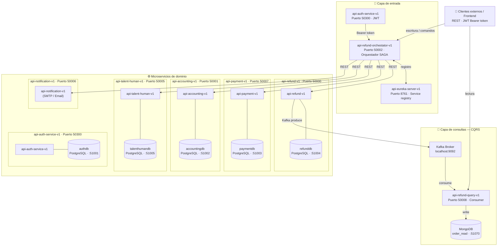

# Arquitectura del Sistema de Reembolsos

## Diagrama general



---

## Descripción por sección

### Sección 1 — Capa de entrada

| Servicio | Puerto | Rol |
|---|---|---|
| `api-auth-service-v1` | 50300 | Autenticación y generación de tokens JWT |
| `api-refund-orchestator-v1` | 50002 | Orquestador central — patrón SAGA con compensación |
| `api-eureka-server-v1` | 8761 | Service registry — descubrimiento de servicios |

El orquestador es el único punto de entrada para operaciones de escritura.
Todos los servicios se registran en Eureka al iniciar.

---

### Sección 2 — Microservicios de dominio

| Servicio | Puerto | Base de datos | Puerto BD |
|---|---|---|---|
| `api-refund-v1` | 50000 | `refunddb` (PostgreSQL) | 51004 |
| `api-payment-v1` | 50007 | `paymentdb` (PostgreSQL) | 51003 |
| `api-accounting-v1` | 50001 | `accountingdb` (PostgreSQL) | 51002 |
| `api-talent-human-v1` | 50005 | `talenthumandb` (PostgreSQL) | 51005 |
| `api-auth-service-v1` | 50300 | `authdb` (PostgreSQL) | 51001 |
| `api-notification-v1` | 50006 | Sin base de datos propia (SMTP) | — |

> `api-refund-v1` actúa además como **Kafka producer**, publicando eventos de dominio
> al broker en `localhost:9092` cada vez que una orden cambia de estado.

---

### Sección 3 — Capa de consultas (CQRS)

| Componente | Detalle |
|---|---|
| **Kafka Broker** | `localhost:9092` — canal de eventos de dominio |
| `api-refund-query-v1` | Puerto 50008 — Kafka consumer, modelo de lectura |
| **MongoDB** | Base `order_read` en puerto `51070` — persistencia del modelo de lectura |

El servicio `api-refund-query-v1` implementa el lado de **lectura del patrón CQRS**:
consume eventos publicados por `api-refund-v1` y proyecta el estado en MongoDB,
optimizado para consultas sin afectar la base de datos transaccional.

---

## Flujos principales

### Crear orden de reembolso
```
Cliente → [POST /orders-refund] → Orquestador
  → api-talent-human-v1  (valida empleado)
  → api-refund-v1        (crea orden)
  → api-refund-v1        → Kafka (evento OrderCreated)
                         → api-refund-query-v1 (proyecta en MongoDB)
```

### Aprobar orden de reembolso (SAGA)
```
Cliente → [PUT /orders-refund/approve] → Orquestador
  → api-refund-v1        (valida estado)
  → api-payment-v1       (genera orden de pago)
  → api-accounting-v1    (registra transacción contable)
  → api-refund-v1        (actualiza estado a APPROVED)
  → api-notification-v1  (notifica al empleado)
  ↩ compensación automática si algún paso falla
```

### Pagar orden de reembolso (SAGA)
```
Cliente → [PATCH /payments/pay-order-refund] → Orquestador
  → api-payment-v1       (procesa pago)
  → api-refund-v1        (marca como PAYED)
  → api-accounting-v1    (registra transacción de pago)
  ↩ compensación automática si algún paso falla
```

---

## Análisis del Código

### Patrones arquitectónicos implementados

| Patrón | Implementación |
|---|---|
| **SAGA Coordinado** | `ApproveOrderRefundWithCompensationService` y `PaymentOrderRefundWithCompensationService` — ejecutan pasos secuenciales y compensan hacia atrás en caso de error |
| **CQRS** | Escritura en PostgreSQL (refunddb) + Lectura en MongoDB (api-refund-query-v1 via Kafka) |
| **Event-Driven** | Kafka como bus de eventos entre servicios |
| **Circuit Breaker** | Resilience4j en `OrderRefundService.create` y `PaymentService.process` |
| **Hexagonal (Ports & Adapters)** | Capas claras: `domain/model`, `application/port/in`, `application/service`, `infrastructure/out`, `infrastructure/in` |
| **Strategy Pattern** | Saga steps como interfaces con `@Component` + `@Order` — los pasos se inyectan automáticamente |
| **JWT Auth** | HMAC-SHA256 con clave compartida entre auth-service y todos los servicios |

### Flujo de Aprobación (SAGA)

Pasos del SAGA de aprobación:

| # | Paso | Order | Responsabilidad |
|---|---|-|
| 1 | `ValidationOrderStep` | 100 | Valida que la orden existe y el supervisor es correcto |
| 2 | `ApproveOrderStep` | 200 | Cambia estado de orden a APPROVED |
| 3 | `CreatePaymentOrderStep` | 300 | Crea orden de pago + notificación al empleado |
| 4 | `NotificationStep` | 400 | Notifica al empleado |

Pasos del SAGA de pago:

| # | Paso | Order | Responsabilidad |
|---|---|-|
| 1 | `ValidationDataStep` | 100 | Carga datos (pago, orden, empleado, supervisor) |
| 2 | `CreateTransactionStep` | 200 | Crea asiento contable (debito gastos / credito bancos) |
| 3 | `PayRefundStep` | 300 | Procesa el pago real |
| 4 | `UpdateRefundStep` | 400 | Marca orden como PAYED |

Mecanismo de compensación (orden inverso):
```
Si un paso falla -> Collections.reverse(executedSteps) -> step.compensate()
```
Cada paso implementa `compensate()` para revertir su efecto (cancelar pago, revertir estado, cancelar transacción contable).

---

## Hallazgos — Problemas y Mejoras

### 4.1. CRITICO — Código de prueba expuesto en producción
**Archivo:** `api-refund-v1/.../ChangeRefundStateService.java:83-85`
```java
if(markProcessError){
    throw new IllegalArgumentException("Error produce para ejemplo SAGA");
}
```
**Problema:** Una propiedad de configuración (`produce.mark-process-error`) puede hacer que una petición válida falle intencionalmente. Este es código de demostración que debería haberse eliminado.
**Recomendación:** Eliminar este bloque o ponerlo bajo un perfil de pruebas dedicado con `@Profile("demo")`.

### 4.2. ALTO — Clave JWT compartida como configuración
**Archivo:** `api-refund-orchestator-v1/.../SecurityConfigJwtLocal.java:42`
```java
@Value("${jwt.secret}") String secret
```
**Problema:** La clave HMAC-SHA256 del JWT se almacena en `application-dev.yml` en texto plano y se replica en todos los servicios. Si alguien obtiene la clave, puede firmar tokens arbitrarios para cualquier rol.
**Recomendación:** Para producción, usar RS256 (RSA) donde cada servicio tiene la clave pública y solo el auth-service tiene la privada.

### 4.3. ALTO — Extracción de user-id del JWT de forma frágil
**Archivo:** `api-refund-orchestator-v1/.../CreateOrderRefundOrchestetorService.java:32`
```java
Long userId = (Long) ((JwtAuthenticationToken) Objects.requireNonNull(securityContext.getAuthentication()))
    .getToken().getClaims().get("user-id");
```
**Problema:**
- Casting manual sin verificación de tipo
- Asumen que el claim `"user-id"` siempre existe
- Si el token no tiene este claim, `get("user-id")` retorna `null` y el cast a `Long` lanza NPE

### 4.4. MEDIO — Compensaciones que silencian errores
**Archivo:** `api-refund-orchestator-v1/.../ApproveOrderRefundWithCompensationService.java:52-54`
```java
catch (Exception compEx) {
    log.error("Compensation failed in step {}: {}", ...);
    //Guardar en una tabla de compensaciones fallidas para reintentos manuales
}
```
**Problema:** El comentario dice "guardar en tabla" pero nunca se implementa. Las compensaciones fallidas se pierden, dejando el sistema en estado inconsistente.
**Recomendación:** Implementar una tabla `compensation_attempts` con lógica de reintentos.

### 4.5. MEDIO — SecurityConfig sin `@Profile` activo
**Archivo:** `api-refund-orchestator-v1/.../SecurityConfigJwtLocal.java:37`
```java
//@Profile("jwt-local")
```
**Problema:** La linea de `@Profile("jwt-local")` está comentada, lo que significa que la config de seguridad se activa siempre independientemente del perfil. Esto puede causar conflictos si el profile `oauth2-github` se activa.
**Recomendación:** Revertir a `@Profile("jwt-local")` para que la config solo se aplique con ese perfil.

### 4.6. MEDIO — NotificationService con reintentos por defecto
**Problema:** El README menciona `@Retry(defaultRetry*)` en `encolarEnvioHtmlMail` pero no se encontró la annotation en el código actual. Posiblemente se eliminó pero falta documentar por qué.
**Recomendación:** Si se eliminó, documentar por qué no se necesita. Si se necesita, restaurarlo y nombrarlo explícitamente (el pattern `defaultRetry*` no se recomienda — usar nombres explícitos).

### 4.7. BAJO — Docker Compose — network externa comentada
**Archivo:** `docker/docker-compose.yml:214`
```yaml
networks:
  ms-trabajo-final-jpinto:
  #    external: true
```
**Problema:** El usuario debe crear el network manualmente (`docker network create ...`) pero el archivo de docker-compose lo tiene comentado. Esto causa confusión al inicio.
**Recomendación:** Quitar el comentario de `external: true` y el network será creado automáticamente.

### 4.8. BAJO — Estado de la orden de pago no se valida
**Archivo:** `api-refund-orchestator-v1/.../ValidationDataStep.java:25`
```java
context.setPaymentResponse(paymentService.getById(...));
```
**Problema:** No se verifica que el pago exista en estado `CREATED` antes de continuar. Si se intenta procesar un pago ya procesado, se duplica el asiento contable.
**Recomendación:** Agregar validación de estado en el paso de validación.

### 4.9. BAJO — No hay validación de auditoria en el rechazo
**Problema:** `RejectOrderRefundOrchestatorService` no verifica que el supervisor que rechaza sea el mismo que aprobó (en la parte de `ValidationOrderStep` solo se valida que la orden exista).
**Recomendación:** Agregar validación en `ValidationOrderStep` de que `login-user-id == approverId`.

---

## Análisis de Código del Orquestador (Detalle)

### CreateOrderRefundOrchestetorService
```java
// Puntos fuertes:
- Usa SecurityContext para obtener user-id del JWT

// Mejorar:
- La notificación de email es "fire and forget" — si falla, no se sabe si se envió
- No hay lógica de rollback si el supervisor no existe
```

### ApproveOrderRefundWithCompensationService
```java
// Puntos fuertes:
- Patrón SAGA bien implementado
- Compensaciones en orden inverso
- Log detallado de cada paso

// Mejorar:
- La validación de roles (SUPERVISOR) está solo en el controller, no en el service
- Si dos supervisores aprueban simultáneamente, no hay bloqueo optimista/pessimista
```

### PaymentOrderRefundWithCompensationService
```java
// Puntos fuertes:
- Compensación de CreateTransactionStep cancela el asiento contable
- PayRefundStep compensa re-creando el pago si falló
- UpdateRefundStep compensa restaurando estado

// Mejorar:
- Si CreateTransactionStep falla, el estado de la orden sigue en APPROVED
  (debería volver a CREATED en la compensación)
```

---

## Recomendaciones de Prioridad

| Prioridad | Acción | Impacto |
|---|---|-|
| **P1** | Eliminar `markProcessError` del código de producción | Evita errores intencionales en el flujo real |
| **P1** | Proteger `user-id` del JWT con verificación de tipo | Evita NPE en producción |
| **P1** | Agregar tabla de compensaciones fallidas | Evita datos inconsistentes |
| **P2** | Cambiar a RS256 para JWT | Mejora seguridad del token |
| **P2** | Revertir `@Profile("jwt-local")` en SecurityConfig | Evita conflictos de config |
| **P2** | Validar estado del pago en `ValidationDataStep` | Evita duplicidad en pagos |
| **P3** | Docker network: quitar `external: true` | Mejora DX al levantar el sistema |
| **P3** | Validar supervisor en `RejectOrderRefundOrchestatorService` | Mejora integridad de datos |